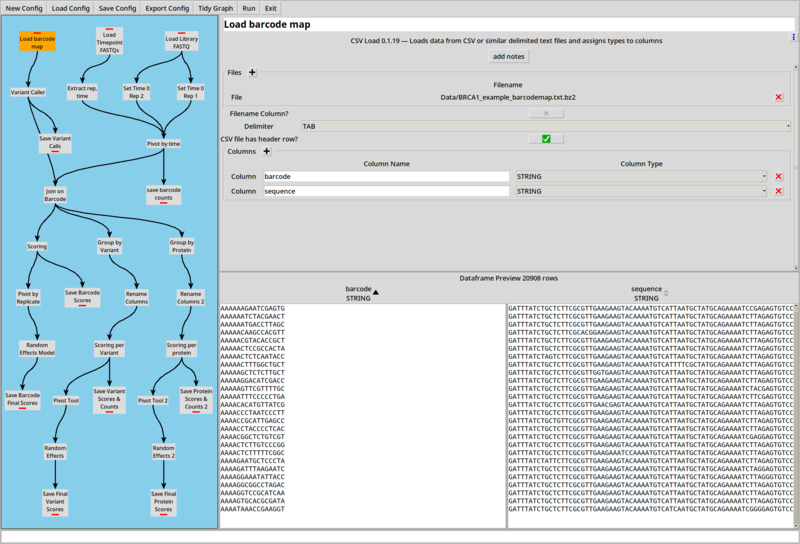
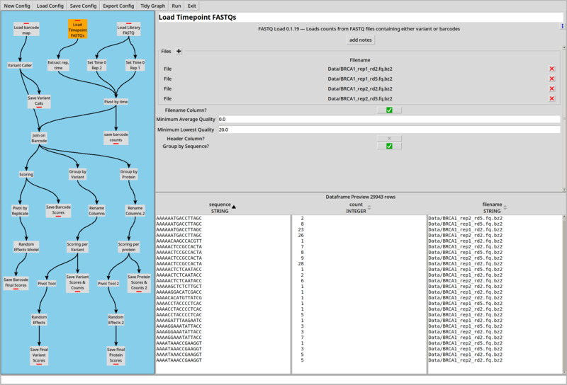
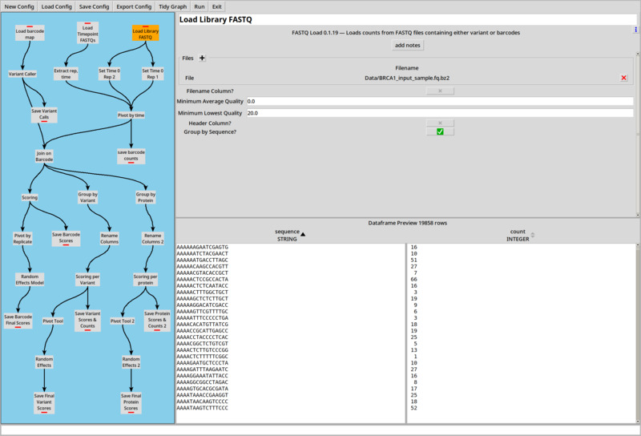
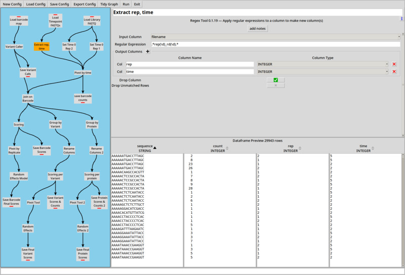
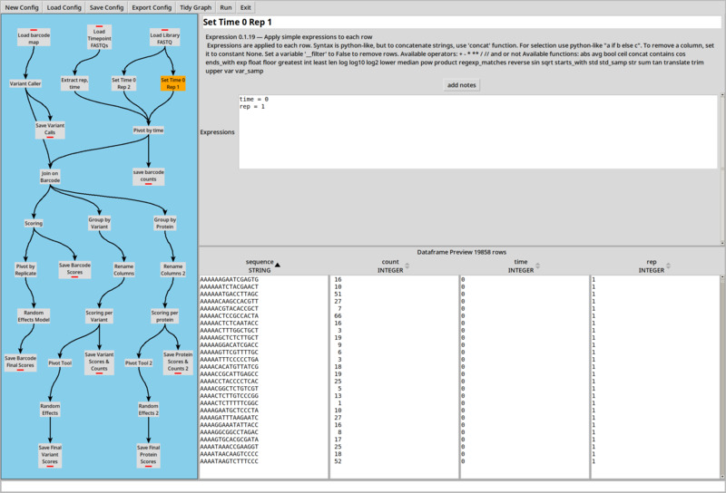
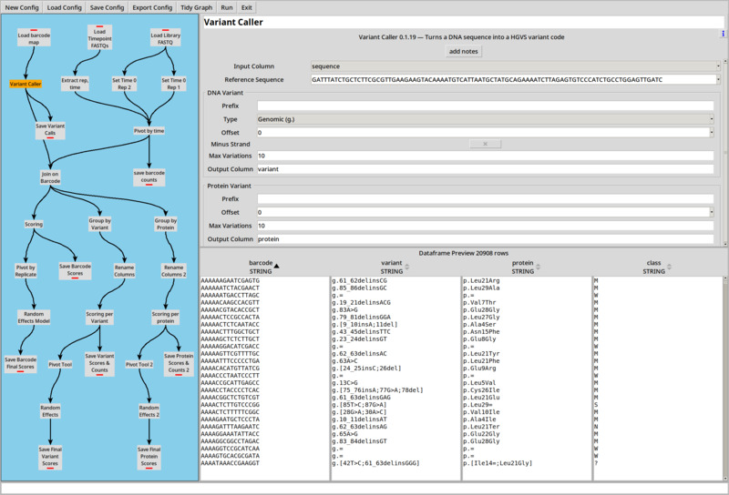
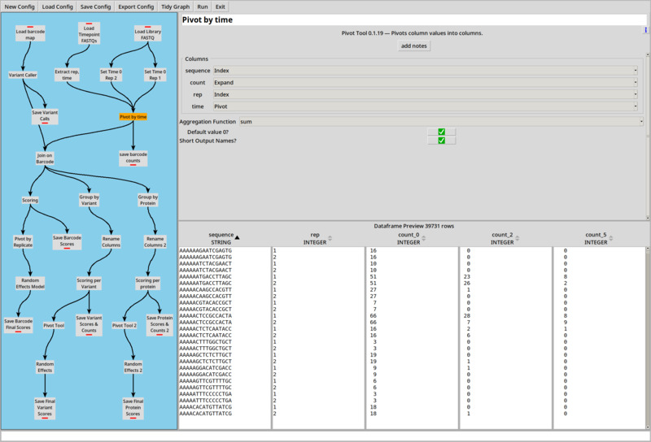
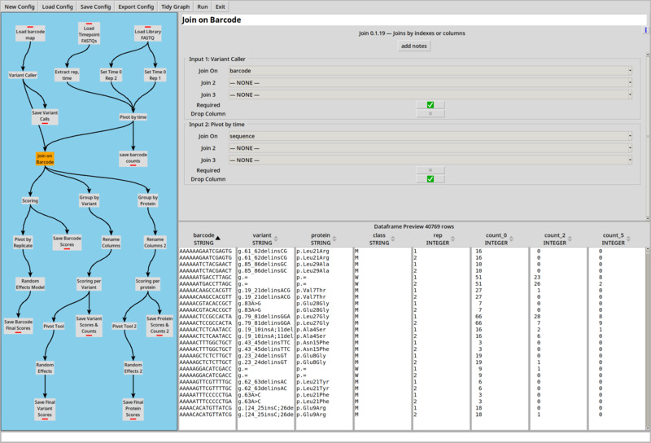
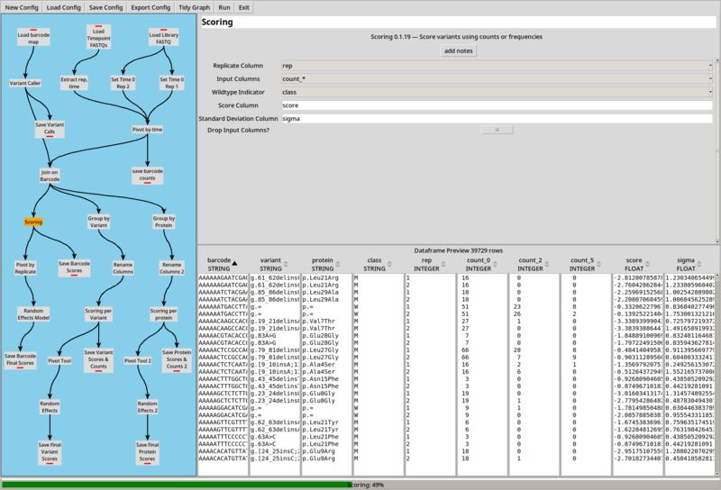

# Further Examples

Continuing on from the examples in [Getting Started with CountESS](../getting-started/)
let's look at a more realistic experiment.

## Example 5: Deep Mutational Scan of BRCA1

This example is based on a small subset of a real deep mutational scan of BRCA1, testing
for E3 ubiquitin ligase activity ([Starita *et al.* 2015](http://dx.doi.org/10.1534/genetics.115.175802)).

The data is taken from the [Enrich2-Example](https://github.com/FowlerLab/Enrich2-Example) project to
make it easy to compare CountESS to [Enrich2](https://github.com/FowlerLab/Enrich2).

Load the example by running `countess_gui example_5.ini`.  Note that this 
data set is bigger than the default limit of rows loaded in the GUI, so only a
subset of the data is used until you click 'Run'.

