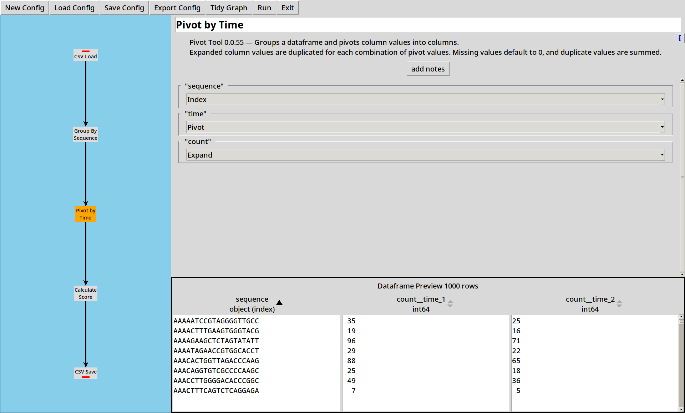
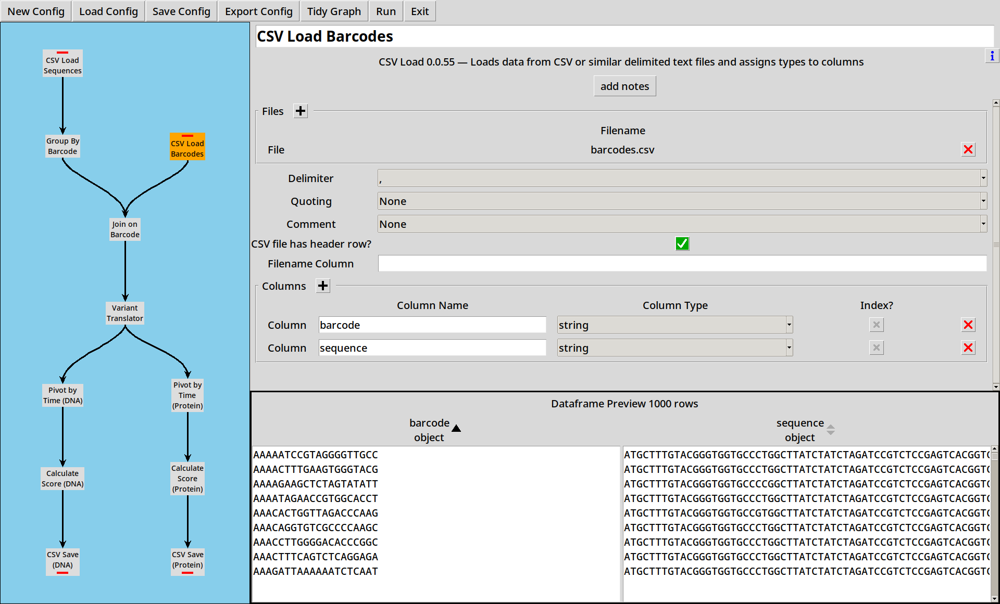
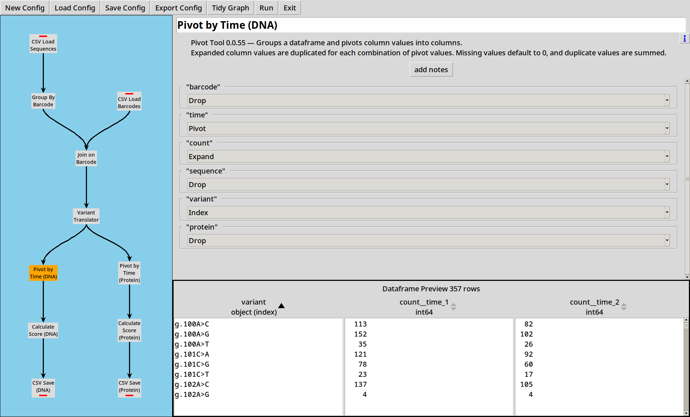

# Getting Started with CountESS

CountESS is more like a toolbox than a single program: it can do all 
sorts of things, but that makes it a little tricky to work out how
to get started.  This tutorial attempts to walk you through some
simplified examples to demonstrate how to solve common bioinformatics
tasks with CountESS.

## Demo Files

The [countess-demo](https://github.com/CountESS-Project/countess-demo/)
project provides a collection of demonstration files for use in these examples.
Demo files consist of randomly generated data.
Any resemblance to organisms living or otherwise is coincidental.

You can download a ZIP of the files
[here](https://github.com/CountESS-Project/countess-demo/archive/refs/heads/main.zip).
or clone the repository using:

```
git clone https://github.com/CountESS-Project/countess-demo/
```

## Example 1: Reading & Counting Sequences

For this simplified example, we'll load up two CSV files with 
DNA sequencing data, count the population of each variant
at two time points and score the variants using the ratio of
their counts.

Load this example up with `countess_gui example_1.ini`.

[](img/example_1_0.png)

There are five nodes in this CountESS pipeline, each of which
transforms the data and then passes it to the next node.
CountESS can also perform operations in parallel, but for the
moment we can understand each of these steps as happening
sequentially.

### 1. Loading CSV files

Sequences are in the files `sequences_1.csv` and `sequences_2.csv`
which just contain a `sequence` column with raw DNA sequences and
a `time` column.

```
sequence,time
AGTTCGAGGACATGGTGAGT,1
GATGTCCTAAGGGTCGATTC,1
TTCAGTACCTAAACTATGTT,1
TTTATATTTCGAGTGAATGT,1
CAACGAGAGATGTAGGAGAA,1
GTAACAGGAGTCATGTTTCC,1
```
*(etc)*

Our first step just reads these two files in.

[](img/example_1_1.png)

* Sequence data can also be loaded from other file formats such 
  as FASTQ, see [Example 4](#example-4-fastq-and-vamp-seq)
* CountESS can also read Gzipped CSV and FASTQ files, and this can
  be faster to read than plain files, depending on your platform.
* With larger files, reads are limited to 100,000 rows when previewing.

### 2. Grouping by Sequence

We now have a dataframe with all our raw sequences in it.
Next we want to count how many times each sequence appears at each
time point.

[](img/example_1_2.png)

The [Group By](../included-plugins/#group-by) tool lets us specify some columns to index by.
If no other operations are selected, it will count the number of 
rows corresponding to each index value, and put this into a 
column called "count".

* The preview pane can be sorted by columns to get a better understanding of your data.
* The "count" operation will count how many rows belong in the group.
  If your data already has "counts", select "sum" on that column to
  sum the counts for each group.

### 3. Pivoting by Time

We've now got separate counts for each sequence at each time point,
but we want to compare counts for each sequence across the time points.

To do this, we use the [Pivot Tool](../included-plugins/#pivot-tool):

[](img/example_1_3.png)

The distinct values of the "Pivot" column(s) are used to expand the
data in the "Expand" column(s) into new columns.

In this case, we're expanding the column `count` into two new columns,
`count__time_1` and `count__time_2`.

* If there are duplicate values in the index, the expanded numbers get summed.
* If there are missing values, they default to zero.
* CountESS only supports pivoting up to 200 output columns.

### 4. Calculating Scores

Now we have pivoted the data, for each sequence we have counts at
two different time points.  We want to calculate scores from the counts
by dividing one by the other:

[](img/example_1_4.png)

The [Python Code](../included-plugins/#python) tool lets us write small expressions in Python and
apply them to each row of the table.  In this case we're calculating
a simplified score as the fraction of sequences which have survived from time 1
to time 2.

### 5. Saving Results

Now we have a score for each sequence, we need to write our data
out somewhere.  The [CSV Save](../included-plugins/#csv-writer)
tool lets us save our output in a CSV file for easy use elsewhere.  

[](img/example_1_5.png)

The output ends up looking like:

```
sequence,count__time_1,count__time_2,score
AAAAATCCGTAGGGGTTGCC,35,25,0.7142857142857143
AAAACTTTGAAGTGGGTACG,19,16,0.8421052631578947
AAAAGAAGCTCTAGTATATT,96,71,0.7395833333333334
AAAATAGAACCGTGGCACCT,29,22,0.7586206896551724
AAACACTGGTTAGACCCAAG,88,65,0.7386363636363636
```
*(etc)*

* The "Text Preview" is just that, a preview.  Nothing is written
  to the file until you click "Run".

## Example 2: Translating Barcodes & Calling Variants

Load this example with `countess_gui example_2.ini`.

### Translating Barcodes

Often, rather than direct sequencing, our sequencing files are full
of "barcodes", and we need to use a barcode map to translate to an
actual sequence.

In this example, we're working with a simple barcode map `barcodes.csv`,
each row of which translates our random 20 base barcodes to various
SNVs of a 147-base protein coding sequence.

```
barcode,sequence
ATTCCCGTAATCTACGATTA,ATGCTTTGTACGGGTGGTGCCCTGGCTTATCTATCTAGATCCGTCTCCGAGTCACGGTCGAATTTAGGTACTGCACTATCCTTTGAGGCGGGAAGGGCCACAAGGGCCGACCCTTGTCGGATAAAATTTGCTAAGAGGAAGGTCTAG
AGTCACAACCAAACCATGGA,ATGCTTTGTACGGGTGGTGCCCTGGCTTATCTATCTAGATCCGTCTCCGAGTCACGGTCGAATTTAGGTACTGCACTATCCTTTGAGGCGGGAAGGGCCACAAGGGCCGACCCTTGTCGGATAAAATTTGCTAAGAGGAAGGTCTAG
TTACGGTCTGCGTTGGAATC,ATGCTTTGTACGGGTGGTGCCCTGGCTTATCTATCTAGATCCGTCTCCGAGTCACGGTCGAATTTAGGTACTGCACTATCCTTTGAGGCGGGAAGGGCCACAAGGGCCGACCCTTGTCGGATAAAATTTGCTAAGAGGAAGGTCTAG
AGGGCCGTGCCAAGTGCAGT,ATGCTTTGTACGGGTGGTGCCCTGGCTTATCTATCTAGATCCGTCTCCGAGTCACGGTCGAATTTAGGTACTGCACTATCCTTTGAGGCGGGAAGGACCACAAGGGCCGACCCTTGTCGGATAAAATTTGCTAAGAGGAAGGTCTAG
TGTAGTGCCGTATTTGTGGC,ATGCTTTGTACGGGTGGTGCCCTGGCTTATCTATCTAGATCCGTCTCCGAGTCACGGTCGAATTTAGGTACTGCACTATCCTTTGAGGCAGGAAGGGCCACAAGGGCCGACCCTTGTCGGATAAAATTTGCTAAGAGGAAGGTCTAG
```
*(etc)*

The first three barcode map to the same sequence,
the other two have SNVs but they are hard to spot!
There are 1000 barcodes in the file, about 1/4 of which
map to unmodified sequences.

First, we modify our sequence reading and grouping steps to rename the sequence column to `barcode`,
for clarity.

[](img/example_2_1.png)
[](img/example_2_2.png)

Second, we add a new node to read the barcode map using the
[CSV Loader](../included-plugins/#csv-reader):

[](img/example_2_3.png)

### Joining

Now we add in a [Join](../included-plugins/#join) tool, which takes two inputs and joins them.

[](img/example_2_4.png)

* Note that while there were 1000 distinct barcodes, there are only 357 distinct
  sequences.  Some barcodes represent duplicate variants.
* By default both inputs are "required", so this is like an inner join, 
  but by toggling one or both flags you can perform a left, right or full join.

### Calling Variants

Working with long sequences is a bit unwieldy: it'd be handy
to be able to process these in a more compact format.  The [Variant Translator](../included-plugins/#variant-caller)
plugin lets us compare a sequence to a reference sequence and extract
DNA and Protein variants in [HGVS](https://hgvs-nomenclature.org/stable/) format.

[](img/example_2_5.png)

We add a Variant Translator to our project, and configure it with
our known reference sequence:

```
ATGCTTTGTACGGGTGGTGCCCTGGCTTATCTATCTAGATCCGTCTCCGAGTCACGGTCGAATTTAGGTACTGCACTATCCTTTGAGGCGGGAAGGGCCACAAGGGCCGACCCTTGTCGGATAAAATTTGCTAAGAGGAAGGTCTAG
```
and it calculates both DNA (`variant`) and Protein (`protein`) variant strings
for each sequence in the dataframe.

Quite a lot of the DNA variants turn out to be equal to the reference sequence (`g.=`) 
and even more of the Protein variants turn out to be synonymous (`p.=`).

### Multiple Outputs

CountESS nodes can have multiple outputs.  From here, we perform the same
pivot, score and write to CSV steps as before, but duplicated for both DNA and Protein variants.

<!--
[](img/example_2_6.png)
[](img/example_2_9.png)
[](img/example_2_7.png)
[](img/example_2_10.png)
-->
[](img/example_2_8.png)
[](img/example_2_11.png)

## Example 3: FASTQ and VAMP-seq

Load this example with `countess_gui example_3.ini`.

### Loading FASTQ

In the previous examples, we've loaded sequence data from CSV files, but 
[FASTQ](https://en.wikipedia.org/wiki/FASTQ_format) files are a more common format
for sequence data and we can read these with the [FASTQ Reader](../included-plugins/#fastq-load)

The CSV files had a convenient `time` column for us to use, but our example
FASTQ files do not.  Fortunately, the metadata we need is available in the 
filename.  We can select the "Filename Column?" option
in the FASTQ Loader which will add an extra `filename` column in to the
dataframe:

[](img/example_3_1.png)

We can then use the [Regex Tool](../included-plugins/#regex-tool) to break this filename down into its 
useful parts, extracting `bin` and `rep` columns from the filename:

[](img/example_3_2.png)

<!--
[](img/example_3_3.png)
-->

In the previous example, we chose to insert the [Variant Translator](../included-plugins/#variant-translator)
after the [Join](../included-plugins/#join) for clarity, but when
we have many more sequences to call it is more efficient to call the variant
once for each barcode rather than once for each sequence:

[](img/example_3_4.png)

<!--
[](img/example_3_5.png)
-->

The two data sources are joined as before.  We can then [pivot](../included-plugins/#pivot-tool)
on `bin`, giving us columns `count__bin_1`, `count__bin_2`, `count__bin_3` and `count__bin_4`:

[](img/example_3_6.png)

### VAMP-seq

[VAMP-seq](https://www.ncbi.nlm.nih.gov/pmc/articles/PMC5980760/)
uses a weighted sum of the bins to calculate a score for each variant,
which is easily implemented in [Python Code](../included-pluyins/#python):

[](img/example_3_7.png)

Files are then written out as before.
<!--
[](img/example_3_8.png)
[](img/example_3_9.png)
-->

