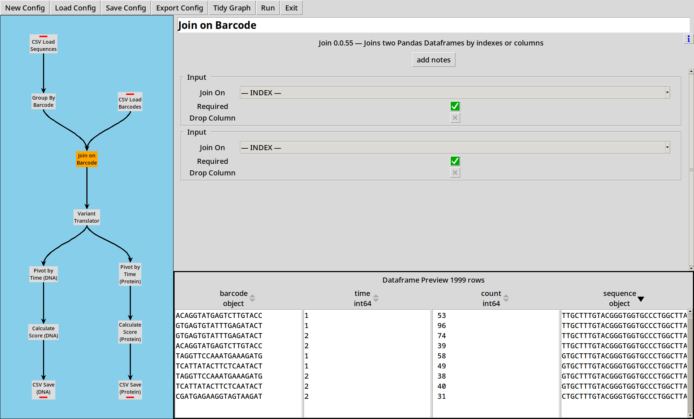
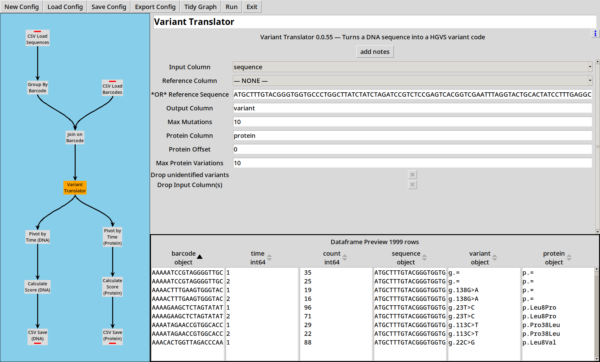
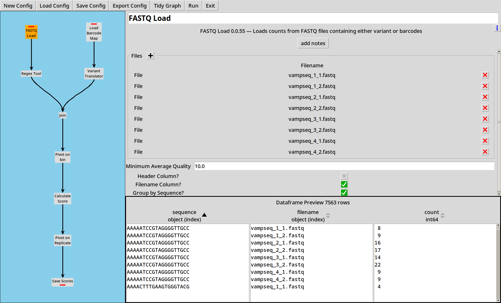
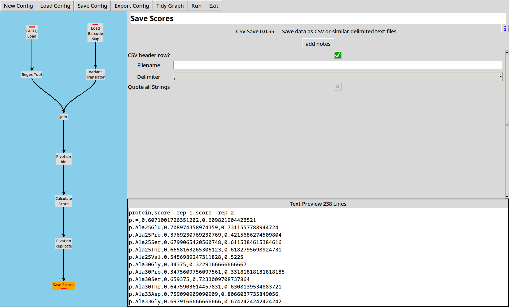
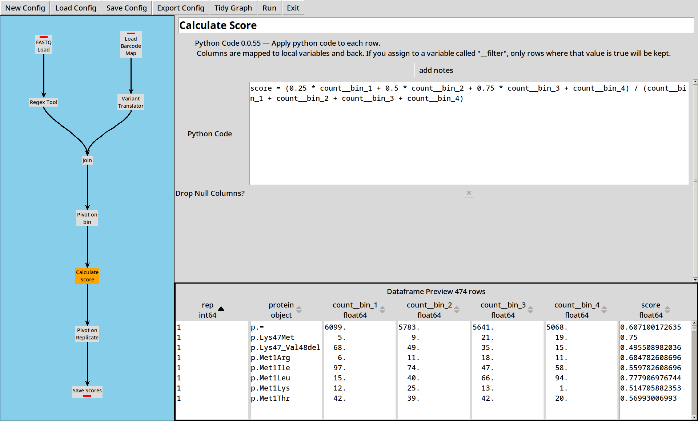

# Getting Started with CountESS

CountESS is more like a toolbox than a single program: it can do all 
sorts of things, but that makes it a little tricky to work out how
to get started.  This tutorial attempts to walk you through a simple 
task to demonstrate how to solve simple bioinformatics tasks with
CountESS.

## Demo Files

The [countess-demo](https://github.com/CountESS-Project/countess-demo/)
project provides a collection of demonstration files for use in these examples.
You can download a ZIP of the files [here](https://github.com/CountESS-Project/countess-demo/archive/refs/heads/main.zip).

Demo files consist of randomly generated data.
Any resemblance to organisms living or otherwise is coincidental.


## Example 1: Reading & Counting Sequences

For this simplified example, we'll load up two CSV files with 
sequencing data, count the sequences and score them using their 
counts at two time points.

Load this example up with `countess_gui example_1.ini`.

[](img/example_1_0.png)

There are five steps in this CountESS pipeline, each of which
is described below:

### 1. Loading CSV files

Sequences are in the files `sequence_1.csv` and `sequence_2.csv`
which just contain raw DNA sequences and a `time` column.

```
sequence,time
AGTTCGAGGACATGGTGAGT,1
GATGTCCTAAGGGTCGATTC,1
TTCAGTACCTAAACTATGTT,1
TTTATATTTCGAGTGAATGT,1
CAACGAGAGATGTAGGAGAA,1
GTAACAGGAGTCATGTTTCC,1
```
*(etc)*

Our first step just reads these two files in.

[](img/example_1_1.png)

* Sequence data can also be loaded from other file formats such 
  as FASTQ
* CountESS can also read Gzipped CSV and FASTQ files, and this can
  be faster to read than plain files, depending on your platform.
* If your data doesn't have a convenient `time` column or equivalent,
  don't worry, you can include the filename as a column and extract
  the metadata from the filename.
* With larger files, reads are limited to 100,000 rows when previewing.

### 2. Grouping by Sequence

We now have a dataframe with all our raw sequences in it.
Next we want to count how many times each sequence appears at each
time point.

[](img/example_1_2.png)

The "Group By" tool lets us specify some columns to index by.
If no other operations are selected, it will count the number of 
rows corresponding to each index value, and put this into a 
column called "count".

* You can sort by columns to get a better understanding of your data.
* If your data already has "counts", select "sum" on that column to
  sum the counts for each group.

### 3. Pivoting by Time

We've now got separate counts for each sequence at each time point,
but we want to compare counts for each sequence across the time points.

To do this, we use the Pivot Tool:

[](img/example_1_3.png)

The distinct values of the "Pivot" column(s) are used to expand the
data in the "Expand" column(s) into new columns.

In this case, we're expanding the column `count` into two new columns,
`count__time_1` and `count__time_2`.

* If there are duplicate values in the index, they get summed.
* If there are missing values, they default to zero.
* CountESS only supports pivoting up to 200 output columns.

### 4. Calculating Scores

Now we have pivoted the data, for each sequence we have counts at
two different time points.  We want calculate scores from the counts.
one by the other:

[](img/example_1_4.png)

The Python Code tool lets us write small expressions in Python and
apply them to each row of the table.  In this case we're calculating
score as the fraction of sequences which have survived from time 1
to time 2.

### 5. Saving Results

Now we have a score for each sequence, we need to write our data
out somewhere.  The CSV Save tool lets us save our output in a 
CSV file for easy use elsewhere.  

[](img/example_1_5.png)

The output ends up looking like:

```
sequence,count__time_1,count__time_2,score
AAAAATCCGTAGGGGTTGCC,35,25,0.7142857142857143
AAAACTTTGAAGTGGGTACG,19,16,0.8421052631578947
AAAAGAAGCTCTAGTATATT,96,71,0.7395833333333334
AAAATAGAACCGTGGCACCT,29,22,0.7586206896551724
AAACACTGGTTAGACCCAAG,88,65,0.7386363636363636
```
*(etc)*

* The "Text Preview" is just that, a preview.  Nothing is written
  to the file until you click "Run".

## Example 2: Translating Barcodes

Load this example with `countess_gui example_2.ini`.

Often, rather than direct sequencing, our sequencing files are full
of "barcodes", and we need to use a barcode map to translate to an
actual sequence.

In this example, we're working with a simple barcode map `barcodes.csv`,
each row of which translates our random 20 base barcodes to a 147-base 
protein coding sequence.

```
barcode,sequence
ATTCCCGTAATCTACGATTA,ATGCTTTGTACGGGTGGTGCCCTGGCTTATCTATCTAGATCCGTCTCCGAGTCACGGTCGAATTTAGGTACTGCACTATCCTTTGAGGCGGGAAGGGCCACAAGGGCCGACCCTTGTCGGATAAAATTTGCTAAGAGGAAGGTCTAG
AGTCACAACCAAACCATGGA,ATGCTTTGTACGGGTGGTGCCCTGGCTTATCTATCTAGATCCGTCTCCGAGTCACGGTCGAATTTAGGTACTGCACTATCCTTTGAGGCGGGAAGGGCCACAAGGGCCGACCCTTGTCGGATAAAATTTGCTAAGAGGAAGGTCTAG
TTACGGTCTGCGTTGGAATC,ATGCTTTGTACGGGTGGTGCCCTGGCTTATCTATCTAGATCCGTCTCCGAGTCACGGTCGAATTTAGGTACTGCACTATCCTTTGAGGCGGGAAGGGCCACAAGGGCCGACCCTTGTCGGATAAAATTTGCTAAGAGGAAGGTCTAG
AGGGCCGTGCCAAGTGCAGT,ATGCTTTGTACGGGTGGTGCCCTGGCTTATCTATCTAGATCCGTCTCCGAGTCACGGTCGAATTTAGGTACTGCACTATCCTTTGAGGCGGGAAGGACCACAAGGGCCGACCCTTGTCGGATAAAATTTGCTAAGAGGAAGGTCTAG
TGTAGTGCCGTATTTGTGGC,ATGCTTTGTACGGGTGGTGCCCTGGCTTATCTATCTAGATCCGTCTCCGAGTCACGGTCGAATTTAGGTACTGCACTATCCTTTGAGGCAGGAAGGGCCACAAGGGCCGACCCTTGTCGGATAAAATTTGCTAAGAGGAAGGTCTAG
```

### Reading Sequences

First, we modify our reading and grouping steps to rename the sequence column to `barcode`,

[](img/example_2_1.png)
<!--
[](img/example_2_2.png)
-->

### Reading the Barcode File

We can read the barcode file using the CSV Loader:

[](img/example_2_3.png)

### Joining the Barcode File

Now we add in a Join tool, which joins the two tables using the `barcode` column.

[](img/example_2_4.png)

The rest of the steps continue as before, but we are now tabulating our data by
the longer `sequence` column.

* Note that while there were 1000 distinct barcodes, there are only 357 distinct
  sequences.  Some barcodes represent duplicate variants.

<!--
[](img/example_2_5.png)
[](img/example_2_6.png)
-->
[](img/example_2_7.png)

## Example 3: Calling Variants

Load this example with `countess_gui example_3.ini`.

Working with long sequences is a bit unwieldy: it'd be handy
to be able to process these in a more compact format.  The "Variant Translator" 
plugin lets us compare a sequence to a reference sequence and extract
DNA and Protein variants in [HGVS](https://hgvs-nomenclature.org/stable/) format.

<!--
[](img/example_3_1.png)
[](img/example_3_2.png)
[](img/example_3_3.png)
[](img/example_3_4.png)
-->

We configure the Variant Translator with our known reference sequence:

```
ATGCTTTGTACGGGTGGTGCCCTGGCTTATCTATCTAGATCCGTCTCCGAGTCACGGTCGAATTTAGGTACTGCACTATCCTTTGAGGCGGGAAGGGCCACAAGGGCCGACCCTTGTCGGATAAAATTTGCTAAGAGGAAGGTCTAG
```
and it calculates both DNA (`variant`) and Protein (`protein`) variant strings
for each sequence in the dataframe.

Quite a lot of the DNA variants turn out to be equal to the reference sequence (`g.=`) 
and even more of the Protein variants turn out to be synonymous (`p.=`).

[](img/example_3_5.png)

### Duplicating Output

#### Pivoting

[](img/example_3_6.png)
[](img/example_3_9.png)

#### Scoring

[](img/example_3_7.png)
[](img/example_3_10.png)

#### Writing CSV

[](img/example_3_8.png)
[](img/example_3_11.png)

